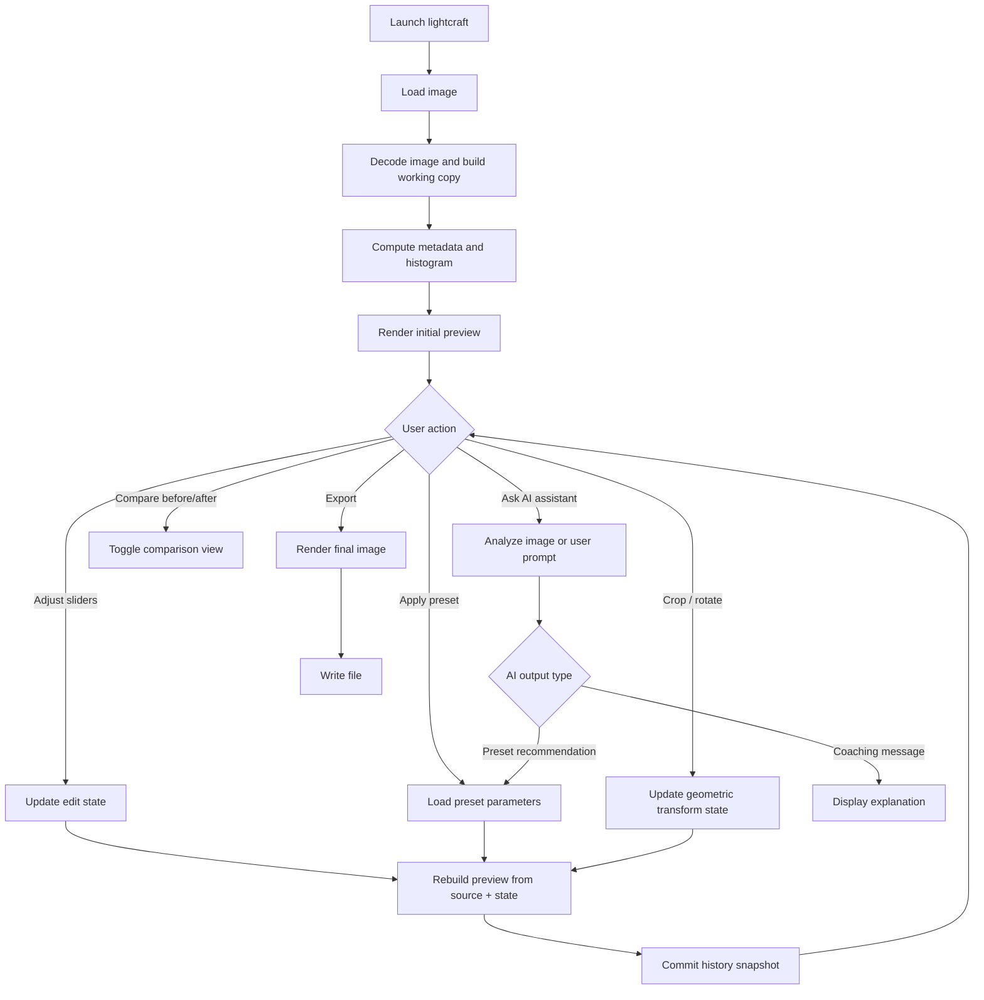
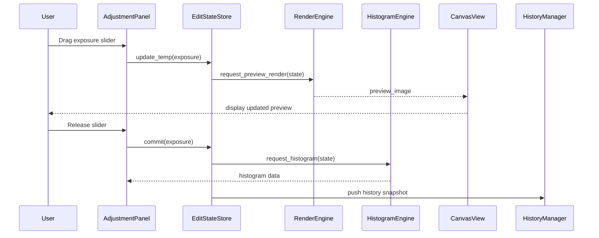
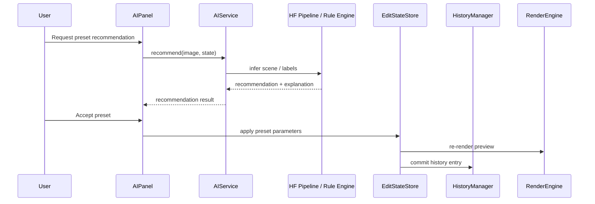

# Software Design Document: `lightcraft`

> Iterative SDD — Each phase builds on the previous one. Implement in order.

---

## Table of Contents

1. [Project Overview](#1-project-overview)
   - [1.1 Goal](#11-goal)
   - [1.2 Overall Execution Flow](#12-overall-execution-flow)
   - [1.3 Target Users](#13-target-users)
   - [1.4 Constraints](#14-constraints)
2. [Phase 1: Basic Image Viewer and Non-Destructive Edit Pipeline](#2-phase-1-basic-image-viewer-and-non-destructive-edit-pipeline)
3. [Phase 2: Core Adjustment Tools and Histogram](#3-phase-2-core-adjustment-tools-and-histogram)
   - [3.7 Sequence Diagram](#37-sequence-diagram)
4. [Phase 3: Crop, Rotate, Compare, and Export](#4-phase-3-crop-rotate-compare-and-export)
5. [Phase 4: Preset System](#5-phase-4-preset-system)
6. [Phase 5: Edit History and Time Travel](#6-phase-5-edit-history-and-time-travel)
7. [Phase 6: Hugging Face AI Assistant](#7-phase-6-hugging-face-ai-assistant)
8. [Risks & Notes](#8-risks--notes)
9. [Appendix: CLI-Free Desktop Launch Flow](#9-appendix-cli-free-desktop-launch-flow)

---

## 1. Project Overview

### 1.1 Goal

Build a Python desktop application named `lightcraft` for beginner photographers. The application guides users through a fixed editing workflow and provides non-destructive photo adjustments, preset recommendation, before/after comparison, export, and edit history.

The project is **not** intended to match Lightroom feature-for-feature. The system focuses on:
- A simple workflow for beginners
- Fast visual feedback
- Core global adjustments only
- Preset-based editing
- Explainable AI assistance instead of full autonomous retouching

### 1.2 Overall Execution Flow

The diagram below shows the full user path from opening an image through analysis, editing, preset application, history tracking, AI assistance, and export.



### 1.3 Target Users

- Beginner photographers
- Students learning image processing
- Casual users who want a guided editing workflow instead of a professional tool with dozens of modules

### 1.4 Constraints

- Python implementation
- Desktop-first UI
- JPEG/PNG support required in MVP
- RAW support is out of MVP scope
- Non-destructive editing only
- Local-first processing
- AI features must fail gracefully when model loading, inference, or network access is unavailable

**Recommended dependencies**:
- `PySide6` for desktop UI
- `opencv-python` for image processing
- `numpy` for image buffer manipulation
- `Pillow` for image I/O interop if needed
- `transformers`, `torch` for Hugging Face model integration
- `piexif` or equivalent for EXIF parsing if metadata display is desired

Qt for Python provides image-view and graphics-view widget patterns suitable for desktop image editing, and Hugging Face pipelines provide a simplified inference interface for multiple task types. citeturn138945search10turn138945search2

---

## 2. Phase 1: Basic Image Viewer and Non-Destructive Edit Pipeline

### 2.1 Requirements

Implement the minimum desktop shell and image-processing backbone.

Required capabilities:
- Open one image file from disk
- Display the image in the main canvas
- Maintain an immutable source image buffer in memory
- Maintain a mutable edit-state object separate from the source image
- Re-render preview from source image + current edit state
- Support reset-to-original
- Show image filename, dimensions, and basic metadata panel placeholder

### 2.2 Functional Scope

Included in Phase 1:
- Single-image editing session
- Zoom-to-fit view
- Scrollable image viewport
- Side panel placeholder for later controls
- Bottom status bar with render status and image dimensions

Excluded from Phase 1:
- Histogram
- Adjustment sliders
- Export
- AI
- History timeline

### 2.3 UI Layout

Suggested desktop layout:

```text
+---------------------------------------------------------------+
| Menu Bar: File  Edit  View  Presets  AI  Help                 |
+---------------------------------------------------------------+
| Left Workflow Panel |           Main Image Canvas             |
| 1. Load            |                                           |
| 2. Analyze         |                                           |
| 3. Adjust          |                                           |
| 4. Style           |                                           |
| 5. Compare         |                                           |
| 6. Export          |                                           |
+---------------------------------------------------------------+
| Status Bar: file name | resolution | zoom | render state      |
+---------------------------------------------------------------+
```

### 2.4 Core Objects

| Object | Responsibility |
|---|---|
| `AppWindow` | Top-level window and action wiring |
| `ImageDocument` | Holds source image, working metadata, and session state |
| `EditState` | Stores current adjustment parameters |
| `RenderEngine` | Rebuilds preview image from source + edit state |
| `CanvasView` | Displays image and handles zoom/pan |

### 2.5 Data Model

```python
class EditState:
    exposure: float = 0.0
    contrast: float = 0.0
    white_balance_temp: float = 0.0
    saturation: float = 0.0
    sharpening: float = 0.0
    denoise: float = 0.0
    shadows: float = 0.0
    rotation_deg: float = 0.0
    crop_rect: tuple[int, int, int, int] | None = None
    applied_preset_id: str | None = None
```

### 2.6 Render Strategy

- Always preserve `source_image`
- Build `preview_image` by applying operations in a fixed order
- Do not stack edits directly on the previous preview buffer
- Recompute from source on each committed state change
- Use a lower-resolution preview for interactive edits if necessary

### 2.7 Processing Order

Even in early phases, processing order must be fixed to prevent visual inconsistency.

Recommended order:
1. Exposure
2. Contrast
3. White balance
4. Saturation
5. Shadows
6. Denoise
7. Sharpening
8. Rotation
9. Crop

### 2.8 Acceptance Criteria

- User can open a JPEG or PNG file successfully
- The original image is shown without corruption
- Reset restores exact original preview
- Internal state change triggers re-render without mutating the source image
- App remains responsive on at least a 12 MP test image

---

## 3. Phase 2: Core Adjustment Tools and Histogram

### 3.1 Requirements

Add the following global adjustment tools:
- Histogram display
- Exposure
- Contrast
- White balance
- Saturation
- Sharpening
- Denoise
- Shadows

### 3.2 UI Controls

Each adjustment must include:
- Slider
- Numeric value label
- Reset-to-default button
- Tooltip / short explanation for beginners

Suggested slider semantics:

| Control | Range | Default | Step |
|---|---:|---:|---:|
| Exposure | -2.0 to +2.0 | 0.0 | 0.05 |
| Contrast | -100 to +100 | 0 | 1 |
| White balance | -100 to +100 | 0 | 1 |
| Saturation | -100 to +100 | 0 | 1 |
| Sharpening | 0 to 100 | 0 | 1 |
| Denoise | 0 to 100 | 0 | 1 |
| Shadows | -100 to +100 | 0 | 1 |

### 3.3 Histogram Requirements

- Show histogram after image load
- Update histogram after each committed edit change
- Prefer RGB histogram overlay or luminance histogram in MVP
- The histogram panel should help users recognize clipping and poor exposure

OpenCV supports histogram calculation and visualization workflows appropriate for this phase. citeturn138945search1

### 3.4 Processing Logic

High-level mapping from controls to operations:

| Control | Suggested Implementation |
|---|---|
| Exposure | Scale luminance or value channel |
| Contrast | Linear contrast stretch around midpoint |
| White balance | Channel gain adjustment or color temperature approximation |
| Saturation | HSV/HSL saturation scaling |
| Sharpening | Unsharp mask or kernel-based sharpening |
| Denoise | Gaussian / bilateral / fast denoising |
| Shadows | Tone mapping applied on dark regions |

### 3.5 Render Policy for Sliders

To avoid UI lag and noisy history logs:
- While dragging a slider, preview may update with debounce
- History snapshot is committed only on slider release
- Histogram may update on debounce or on release depending on performance

Recommended debounce target:
- 50 to 120 ms for preview update
- Commit history only after user stops dragging

### 3.6 Error Handling

- If an operation fails, keep last valid preview
- Display non-blocking toast or status-bar error
- Never destroy source image or session state

### 3.7 Sequence Diagram

The sequence diagram below shows a slider-driven adjustment cycle.



### 3.8 Acceptance Criteria

- All seven adjustment controls affect preview correctly
- Histogram is visible and updates consistently
- Resetting an individual control restores its default value
- Rapid slider motion does not freeze the UI
- Source image remains unchanged in memory

---

## 4. Phase 3: Crop, Rotate, Compare, and Export

### 4.1 Requirements

Add geometric transforms and output functionality.

Required capabilities:
- Rotate image in 90-degree increments at minimum
- Optional free-angle rotation if performance allows
- Crop via interactive rectangle selection
- Before/after comparison
- Export edited image

### 4.2 Compare Modes

At least one comparison mode is required in MVP:
- Toggle original / edited

Optional comparison modes:
- Split view slider
- Side-by-side view

### 4.3 Export Requirements

Supported export formats in MVP:
- JPEG
- PNG

Export configuration:
- Output path
- Output filename
- JPEG quality setting
- Optional resize before export

### 4.4 Export Logic

- Re-render final image from `source_image + committed state`
- Do not export from a low-resolution preview buffer
- Preserve orientation consistency
- Fail safely on invalid output path or permission error

### 4.5 Acceptance Criteria

- User can crop and see resulting preview
- Rotation produces visually correct output
- Before/after comparison is immediate and clear
- Exported file matches edited preview within expected format limits
- Original input file is never overwritten unless explicitly allowed in a future version

---

## 5. Phase 4: Preset System

### 5.1 Requirements

Add a preset subsystem with exactly six built-in presets that cover common beginner use cases.

### 5.2 Built-In Presets

Recommended preset set:

| Preset ID | Name | Intended Scenario |
|---|---|---|
| `preset_auto_clean` | Auto Clean | Generic correction for flat images |
| `preset_portrait_soft` | Portrait Soft | Human portraits, softer tones |
| `preset_landscape_clear` | Landscape Clear | Outdoor scenes, stronger clarity and color |
| `preset_night_rescue` | Night Rescue | Low-light scenes with shadow lift and denoise |
| `preset_food_warm` | Food Warm | Warmth and moderate color pop |
| `preset_bw_contrast` | B&W Contrast | High-contrast monochrome look |

### 5.3 Preset Representation

Each preset must be stored as a parameter bundle rather than a lookup image.

Example JSON-like structure:

```json
{
  "id": "preset_landscape_clear",
  "display_name": "Landscape Clear",
  "parameters": {
    "exposure": 0.20,
    "contrast": 18,
    "white_balance_temp": 5,
    "saturation": 12,
    "sharpening": 25,
    "denoise": 5,
    "shadows": 10
  }
}
```

### 5.4 Preset Behavior

- Applying a preset overwrites the relevant adjustment parameters
- A preset application creates a history entry
- User may further fine-tune sliders after preset application
- UI must show the active preset name if one is applied

### 5.5 Acceptance Criteria

- All six presets are selectable and render different visual outcomes
- Applying a preset updates preview and history
- User can apply a preset and then continue manual editing
- Reset returns to no-preset default state

---

## 6. Phase 5: Edit History and Time Travel

### 6.1 Requirements

Add a history system for:
- Undo
- Redo
- Jump to any previous committed state
- Inspect named edit steps
- Continue editing from a selected past state

### 6.2 History Model

The system uses committed snapshots of `EditState`.

Each history entry should include:
- Step index
- Timestamp
- Action label
- Serialized edit state
- Optional thumbnail preview in later versions

Example:

```python
class HistoryEntry:
    step_id: int
    timestamp: str
    label: str
    state: EditState
```

### 6.3 Commit Rules

Create a history entry when:
- Preset is applied
- Slider drag is released
- Crop is confirmed
- Rotation is confirmed
- Reset is triggered
- AI recommendation is accepted

Do not create a history entry for:
- Hover interactions
- Intermediate slider ticks during dragging
- Compare toggle
- AI chat text generation alone

### 6.4 UI Requirements

History panel should display a vertical list such as:

```text
[0] Original
[1] Exposure +0.35
[2] Landscape Clear preset
[3] Crop 4:5 portrait
[4] Denoise +15
```

User actions:
- Click an entry to jump to that state
- Undo moves one step backward
- Redo moves one step forward
- Editing from a past state truncates future branch in MVP

### 6.5 Acceptance Criteria

- Undo and redo operate on committed states only
- Jumping to a previous step updates preview correctly
- New edits after time-travel truncate future history in MVP
- No history action corrupts the original source image

---

## 7. Phase 6: Hugging Face AI Assistant

### 7.1 Requirements

Add optional AI-assisted features:
1. Preset recommendation based on the loaded image
2. Editing chat coach that explains what the user may want to adjust next

AI features are assistive only. They must not be required for core editing.

### 7.2 Subsystem Scope

| AI Feature | Purpose | Output |
|---|---|---|
| Preset recommendation | Predict a suitable starter preset | Preset ID + confidence + explanation |
| Editing chat coach | Beginner-friendly guidance | Text response grounded in current image state |

Transformers pipelines provide a unified interface for inference, including image and text tasks, which suits this modular AI layer. citeturn138945search2turn138945search14turn138945search17

### 7.3 AI Integration Modes

The design must support two operation modes:

**Mode A: Local model available**
- Run inference locally through `transformers` pipeline

**Mode B: Model unavailable or unsupported hardware**
- Fall back to rule-based recommendation and static coaching templates

### 7.4 Preset Recommendation Logic

Preferred approach for MVP:
- Use lightweight image classification or zero-shot image classification
- Map scene labels to presets

Example mapping:

| Scene Label | Recommended Preset |
|---|---|
| portrait / person | `preset_portrait_soft` |
| landscape / nature | `preset_landscape_clear` |
| night / city at night | `preset_night_rescue` |
| food / meal | `preset_food_warm` |
| monochrome style request | `preset_bw_contrast` |
| unknown | `preset_auto_clean` |

### 7.5 Chat Coach Behavior

Input sources:
- User message
- Current `EditState`
- Lightweight image analysis summary
- Optional histogram summary

Example prompts the UI may support:
- “Why does this photo look dull?”
- “What should I adjust first?”
- “Why did you recommend this preset?”
- “How do I make this portrait look softer?”

### 7.6 Safety and Reliability Rules

- AI assistant must never claim an edit was applied unless the user confirms the action
- Recommendation confidence should be shown if available
- If inference fails, show fallback guidance immediately
- Do not block the editing UI while AI inference is running
- AI results should be cancelable or timeout-bounded

### 7.7 Sequence Diagram



### 7.8 Acceptance Criteria

- AI feature can be disabled without breaking the app
- Recommendation returns a preset or fallback result
- Chat coach returns a response within acceptable UX bounds or fails gracefully
- Accepting an AI recommendation creates a history entry
- AI never mutates image state without explicit user action

---

## 8. Risks & Notes

### 8.1 Product Risks

| Risk | Description |
|---|---|
| Scope inflation | Trying to imitate Lightroom too closely will exceed time budget |
| UI lag | Full-resolution re-render on each slider tick may freeze the app |
| AI dependency risk | Local models may be too large or too slow for student hardware |
| Inconsistent preview/export | Preview pipeline and export pipeline may diverge if coded separately |
| History bloat | Over-committing snapshots can waste memory and clutter UX |

### 8.2 Technical Risks

| Risk | Description |
|---|---|
| Color shifts | White balance and saturation implementation may produce artifacts |
| Over-sharpening halos | Aggressive sharpening may degrade output visibly |
| Denoise softness | Noise reduction can destroy detail |
| Crop/rotate ordering bugs | Wrong operation order changes exported framing |
| AI hallucination | Chat coach may give bad advice unless tightly constrained |

### 8.3 Recommended Development Order

```text
Phase 1 -> Verify image load, canvas, source/preview separation
Phase 2 -> Verify global adjustment pipeline and histogram
Phase 3 -> Verify crop/rotate/compare/export consistency
Phase 4 -> Verify preset architecture and beginner workflows
Phase 5 -> Verify history correctness and branch truncation
Phase 6 -> Verify AI integration and rule-based fallback
```

### 8.4 Out of Scope for MVP

- RAW workflow and demosaicing
- Local masking / brush editing
- Healing / clone stamp
- Layer system
- Batch editing
- Multi-image catalog management
- Cloud sync

---

## 9. Appendix: CLI-Free Desktop Launch Flow

### 9.1 Launch Behavior

This is a GUI-first desktop application. No CLI usage is required for normal users.

Expected launch sequence:
1. User opens desktop app
2. Main window appears with empty-state screen
3. User clicks “Open Image”
4. Application loads image and enters workflow step 2 automatically

### 9.2 Empty-State Requirements

When no image is loaded, display:
- App name
- “Open Image” primary button
- Optional “Recent Files” placeholder for future version
- Optional short description of the workflow

### 9.3 Suggested File Structure

```text
lightcraft/
├── app.py
├── main_window.py
├── models/
│   ├── image_document.py
│   ├── edit_state.py
│   └── history_entry.py
├── services/
│   ├── render_engine.py
│   ├── histogram_engine.py
│   ├── export_service.py
│   ├── preset_service.py
│   └── ai_service.py
├── ui/
│   ├── canvas_view.py
│   ├── workflow_panel.py
│   ├── adjustment_panel.py
│   ├── histogram_panel.py
│   ├── history_panel.py
│   └── ai_panel.py
├── presets/
│   └── builtins.json
└── tests/
```

### 9.4 Final Note

This SDD is intentionally implementation-oriented. It defines build order, state boundaries, phase-specific acceptance criteria, and interaction rules so the project can be implemented incrementally without drifting into an oversized photo editor.
